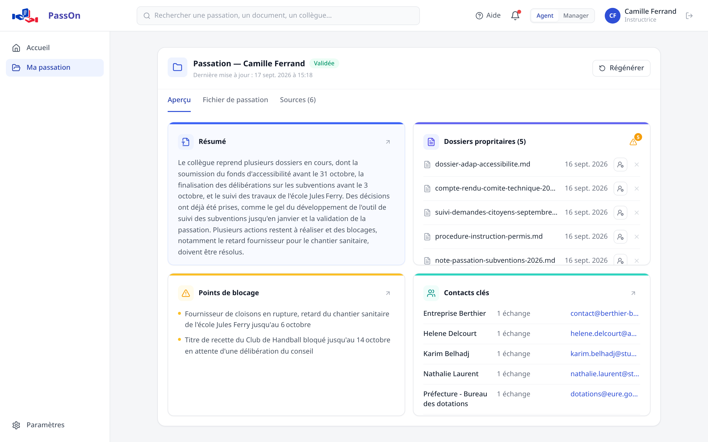

<p align="center">
  <em>Built for the DINUM × 42 hackathon</em>
</p>

<p align="center">
  <a href="https://github.com/liliane0128/PassOn_Dinum/stargazers/">
    
  </a>
  <a href="https://github.com/liliane0128/PassOn_Dinum/blob/main/LICENSE">
    
  </a>
</p>

<p align="center">
  <a href="src/backend/connectors/README.md">Connectors</a> ·
  <a href="src/backend/accounts/README.md">Accounts</a> ·
  <a href="src/backend/passon/README.md">Schema</a> ·
  <a href="docs/DEPLOYEMENT.md">Deployment</a>
</p>

# PassOn: Handover Assistant

**PassOn reads a colleague's Docs and Drive to generate a structured handover sheet — powered by an LLM.**



> [!IMPORTANT]
> PassOn is an independent project built **on top of** La Suite numérique. It is
> not affiliated with, endorsed by, or an official product of DINUM or La Suite
> numérique. The La Suite logo appears in the application to mark that
> integration; it belongs to La Suite numérique, not to this project.

### Why use PassOn ❓

* 📋 Pulls documents and files from Docs and Drive automatically
* 🤖 Extracts structured handover sections via LLM
* 🔑 Login with your existing Drive account — no separate account needed
* 🗂️ Résumé lives in a shared Docs file — the agent validates it, the manager can still correct it


### Getting started 🔧

**Prerequisites:** Docker, Docker Compose, GNU Make.

```bash
make up
```

Builds and starts nginx + the frontend + Django + Postgres. Everything is on
**http://localhost:8090**.

Everything is on that one port. The landing page is a static file served from
disk; every other path is proxied, the application to its own container and
`/api/` to Django, so the app and the API share one origin — which is what the
session cookie and Django's CSRF check require.

| URL | Served by |
|-----|-----------|
| `http://localhost:8090/` | the landing page, a static file |
| `http://localhost:8090/dashboard` | the application: generate a handover |
| `http://localhost:8090/gerer-ma-passation` | the handover itself |
| `http://localhost:8090/equipe` | the manager's team view |
| `http://localhost:8090/login` | the login page |
| `http://localhost:8090/api/…` | Django |

The landing page's button asks `/api/auth/me/` who is logged in and goes to the
application or to the login page accordingly; the application redirects to
`/login` on its own if it is opened without a session.

Nothing has to be started by hand: `make up` builds and runs the frontend
alongside nginx, Django and Postgres. For interface work, `npm run dev -- -p
3001` inside `src/frontend` serves it on :3001 — but `/api/` is not proxied
there, so logging in only works through :8090.

On first run, copy the env templates:

```bash
cp template.env .env
cp src/backend/.env.example src/backend/.env
```

By default `DINUM_USE_MOCK=true` — the app runs on demo data without Docs or Drive.

### Login

PassOn has no accounts of its own. Log in with your **Drive** credentials:

```
POST /api/auth/login/   {"email": "...", "password": "..."}
```

Roles are ours rather than Drive's: `manage.py set_role <email> manager` is how a
manager account comes to exist.

### Useful commands

```bash
make up      # build and start the full stack
make down    # stop everything
make logs    # follow logs

make run     # backend only (Django on http://localhost:8000)
make stop    # stop backend stack
make build   # rebuild images
```

Frontend dev server, for interface work (hot reload):

```bash
cd src/frontend && npm install && npm run dev -- -p 3001
# → http://localhost:3001 — no /api there, so logging in needs :8090
```

### Running alongside upstream services 🔌

PassOn reads real data from **Docs** and **Drive**. Each is an independent Docker Compose stack. These are each project's own defaults, as published by their compose files:

| Service | API | Frontend | Keycloak |
|---------|-----|----------|----------|
| Drive | http://localhost:8071 | http://localhost:3000 | localhost:8083 (8080 direct) |
| Docs | http://localhost:8071 | http://localhost:3000 | — |

> [!WARNING]
> **Docs and Drive both default to 8071**, and both serve a frontend on 3000.
> Running the two together means moving one of them and setting `DOCS_URL` or
> `DRIVE_URL` accordingly — otherwise calls meant for one land on the other.
> Only Drive is needed for login and for generating a handover.

> [!NOTE]
> Drive's Keycloak occupies **8080**, which is why PassOn serves on 8090.

> [!TIP]
> **[docs/DEPLOYEMENT.md](docs/DEPLOYEMENT.md)** covers this end to end: start-up
> order, creating a working account in Drive's Keycloak, and a table mapping each
> failure message to its cause. Most of it is not guessable.

```bash
# Docs
cd /path/to/docs && make bootstrap FLUSH_ARGS='--no-input' && make run

# Drive
cd /path/to/drive && make bootstrap && make demo && make run
```

Default credentials, and the session cookie each service issues:

| Service | Username | Password | Cookie |
|---------|----------|----------|--------|
| Docs | `impress` | `impress` | `docs_sessionid` |
| Drive | `drive` | `drive` | `drive_sessionid` |

> [!WARNING]
> Set `DINUM_USE_MOCK=false` and `DRIVE_URL` in `src/backend/.env` before connecting to a real Drive instance.
> See [the accounts doc](src/backend/accounts/README.md) for the CSRF handshake and Keycloak quirks.

### Database 🗄️

One Postgres instance, shared by both stacks (`make up` and `make run`).

| Table | What |
|-------|------|
| `Collaborator` | One row per person — role, team, reporting line |
| `Handover` | Handover sheet: free text + six structured sections, validated or not |
| `CollaboratorItem` | Snapshot of someone's documents and files, so their manager can read them |

To seed demo data in Drive:

```bash
docker compose exec web python manage.py seed_demo --email ... --password ...
```

It uploads five documents to that person's Drive, written so every section of
the generated handover has something to find. See
[demo_data](src/backend/passon/demo_data/README.md).

### Contributing 🙌

PRs are welcome — open an issue to discuss anything substantial first.

Per-area documentation: [connectors](src/backend/connectors/README.md) (upstream
clients and the LLM pipeline), [accounts](src/backend/accounts/README.md) (login),
[schema](src/backend/passon/README.md) (collaborators and handovers),
[server](src/server/README.md) (nginx and the single-origin setup),
[frontend](src/frontend/README.md).

This README is English only. The per-area documents linked above carry an
English half and a French one: when you change one, change the other in the
same commit — a translation left behind is worse than none, because it is
believed.

### License 📝

Released under the [MIT License](LICENSE).

The MIT licence covers this project's own code. It does not extend to the La
Suite numérique name or logo, nor to any French State emblem, which remain the
property of their holders and are used here only to identify the services
PassOn connects to.

---

## Gov ❤️ open source

PassOn is part of the **La Suite Numérique** ecosystem, a joint initiative led by [DINUM](https://www.numerique.gouv.fr/dinum/).
